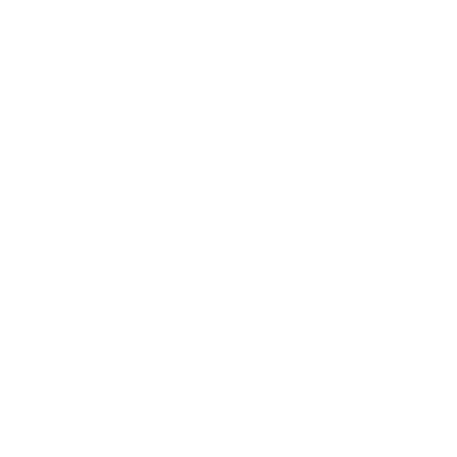

 

<dev align="center">
    <h1><b>Hi there, Im Wiesel aka Roman.K </b></h1>
</dev>

<h2><b>About Me :</b></h2>
Hi Im Wiesel aka. Roman.K.
Currently Im studyng Information Technoligy at the BBS-ME in germany.

 
 

<h2><b>Skills :</b></h2>

    
    
    
    

 

<h2><b>Currently Learning </b></h2>

    
</dif>

 
 

<h2><b>Socials </b></h2>

    
</dif>
 
 

